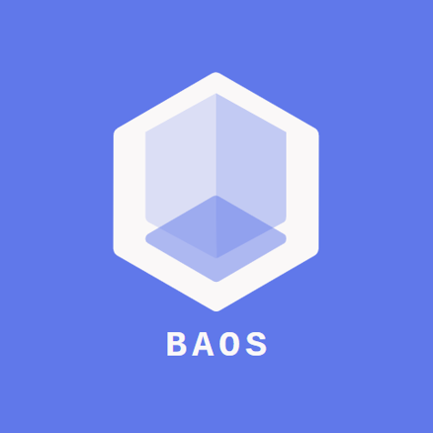

# 2019 OPEN SOURCE PROJECT 02
# MAKING BAOS GAME

## FILTERS OF OUR SOURCE FILES

### Animation
> ### This is for load and rendering object's animation.
>> * Anilist.h
>> * AniObj.h + AniObj.cpp
>> * AniRender.h + AniRender.cpp
>> * AniEvent.h + AniEvent.cpp
>> * DirectionAniRender.h + DirectionAniRender.cpp
>> * ProcessAniEvent.h + ProcessAniEvent.cpp

### GameArea
> ### Performing the function of organizing the maps and stages of the game.
>> * GameArea.h + GameArea.cpp
>> * GameStage.h + GameStage.cpp
>> * GameTileMgr.h + GameTileMgr.cpp
>> * Neos_Area.h + Neos_Area.cpp
>> * Dark.h + Dark.cpp

### GameObj
> ### Performing the function of importing, storing, and managing objects and ini-files of the game.
>> * GameObj.h + GameObj.cpp
>> * GameObjContainer.h + GameObjContainer.cpp
>> * GameObjController.h + GameObjController.cpp
>> * GameObjMgr.h + GameObjMgr.cpp
>> * GameObjPool.h + GameObjPool.cpp

### > Object
> ### These are about the objects of the game.
>> * Health.h + health.cpp
>> * Tile.h + Tile.cpp
>> * EricController.h + EricController.cpp
>> * Player.h + Player.cpp
>> * Creature.h + Creature.cpp
>> * CreatureAI.h + CreatureAI.cpp
>> * Tower.h + Tower.cpp

### Render
> ### Perfoming the function of rendering and making sprite images and UIs of the game.
>> * ImgRender.h + ImgRender.cpp
>> * Render.h + Render.cpp
>> * Texture.h + Texture.cpp
>> * Sprite.h + Sprite.cpp
>> * Effect.h + Effect.cpp

### UI
> ### Performing the function of importing and managing UIs of the game.
>> * UI.h + UI.cpp
>> * UIAniRender.h + UIAniRender.cpp
>> * UIImgRender.h + UIImgRender.cpp
>> * UIMgr.h + UIMgr.cpp
>> * UILIST.h

### Basic
> ### Basic components of our game.
>> * Camera.h + Camera.cpp
>> * Mouse.h + Mouse.cpp
>> * Debug.h + Debug.cpp
>> * GameFontMgr.h + GameFontMgr.cpp
>> * FontList.h
>> * PathFinder.h + PathFinder.cpp
>> * Util.h + Util.cpp
>> * FSM.h + FSM.cpp

### Main
> ### Main source files which have important roles of our game.
>> * Home.h
>> * Empty dark.cpp
